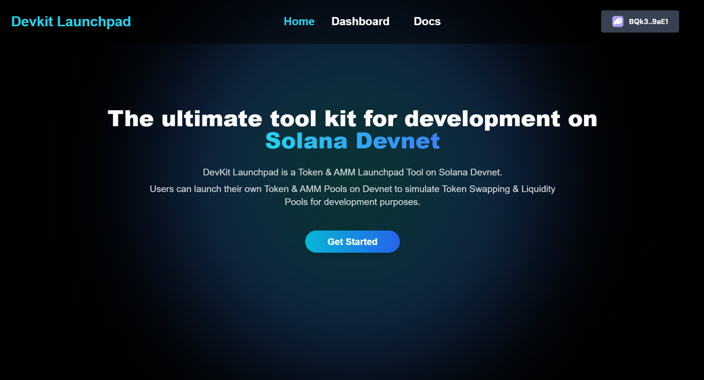
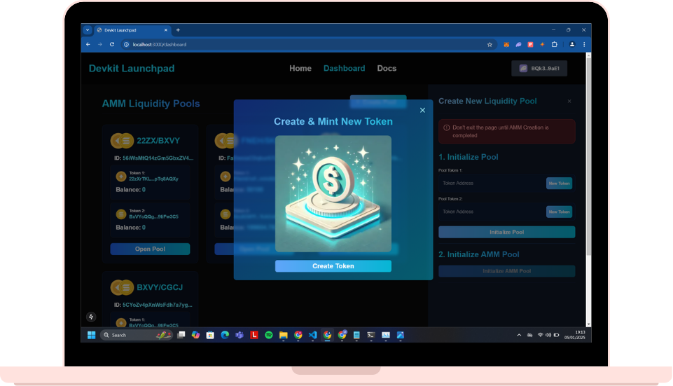
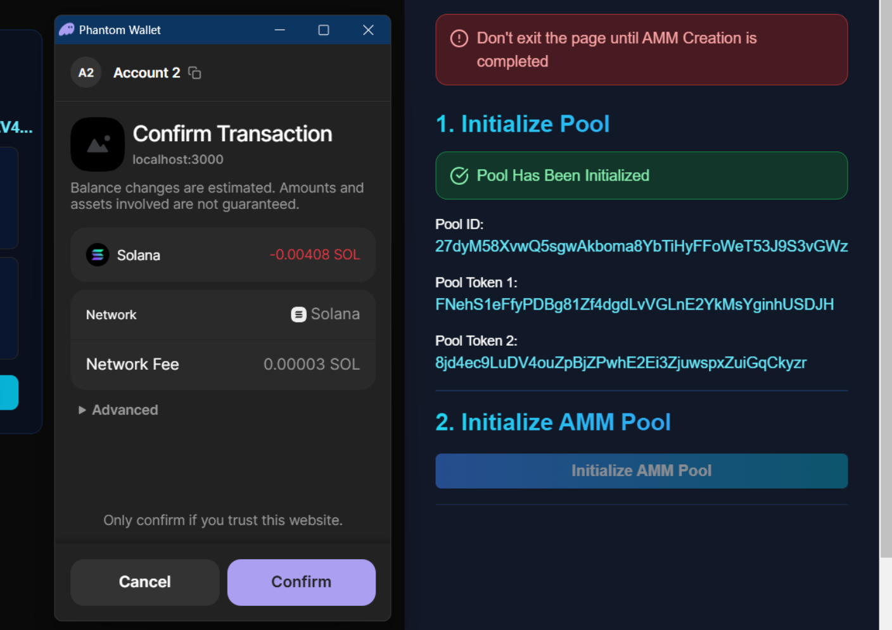
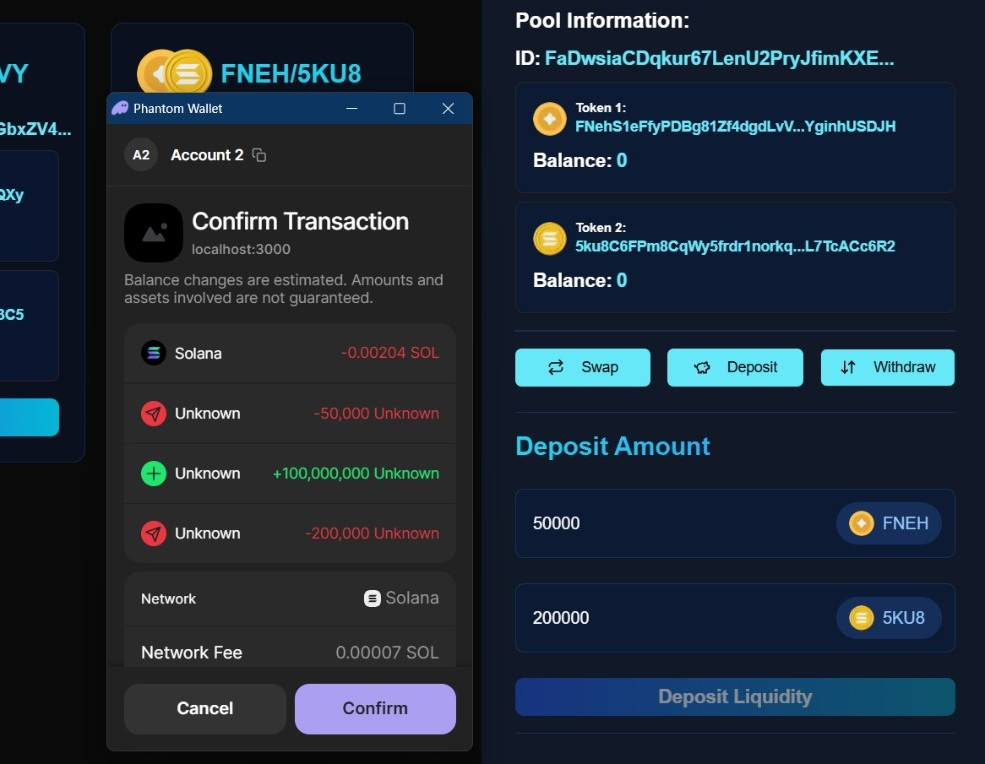
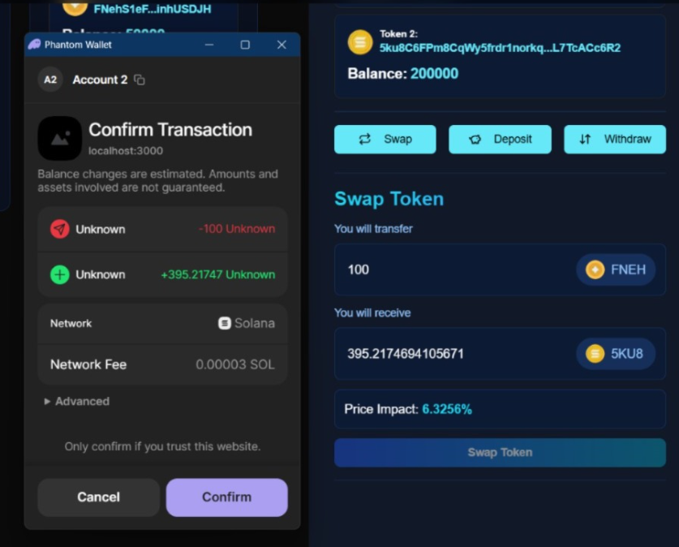

# Devkit Launchpad

Devkit Launchpad is the ultimate tool for developers building on Solana. It provides a platform to create and manage tokens, liquidity pools, and simulate token swapping, enabling seamless testing and development of Solana smart contracts.

## Features

- **Token Launching**: Easily create and mint tokens on Solana Devnet for testing and development.
- **Aggregated Market Making Pools**: Build and simulate liquidity pools to test token swapping functionality, similar to platforms like Radium, Orca, and Jupiter.
- **Simulated Environment**: Test smart contracts and programs in a Solana Mainnet-like environment without deploying on the mainnet.
- **API Integration (Coming Soon)**: Simplify token swap instructions with API calls to integrate with your applications.

## Use Cases

- Test smart contracts and programs in a controlled environment.
- Simulate token swapping and liquidity management.
- Launch and test tokens before mainnet deployment.

## Quick Links

- **Project Information**: [Devkit Launchpad on Linktree](https://linktr.ee/devkit_launchpad)
- **Demo Video**: [Watch the Demo](https://tr.ee/LTkqQmIRHD)
- **Live Website**: [Access Devkit Launchpad](https://devkit-launchpad.vercel.app/)

## How It Works

1. **Connect Wallet**: Open the dashboard and connect your Solana wallet.
2. **Create Tokens**: Mint new tokens or use existing ones on Solana Devnet.
3. **Initialize Liquidity Pools**: Set up aggregated liquidity pools for token swapping simulations.
4. **Simulate Token Swapping**: Deposit liquidity and test token swaps through the platform.
5. **API Integration (Upcoming)**: Fetch instructions to programmatically integrate token swaps into your applications.

## Screenshots

### Landing Page

### Create Token

### Initialize AMM

### Deposit Liquidity

### Swap Token

## Future Plans

- API integration to enable developers to simulate token swaps directly through API calls.

## Get Started

Visit our [Live Website](https://devkit-launchpad.vercel.app/) to explore the platform and start building on Solana today!